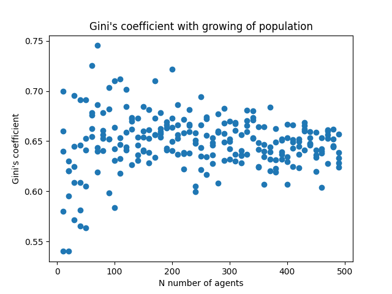

# Mesa---Agent-based-modeling
Doing of the introductory and advanced tutorial for an agent-based modeling in Python

## Folder: Model 1 - money

Inside the folder Model 1 - money, you can run `firstmodel.py` to see how money would be distributed between 10 agents if each agent started with 1 unit of cash and sent it to another agent at the end of one step. There is 10 steps and an agent can only send money to another one if it has a positive amount of cash.

Also, in an attempt to reduce the noise of the results, if you run `firstmodel_manymodels.py*`, you can see the resulting histogram of 100 cases of the same situation in firstmodel.py, so you can better analyse and see that it's common to many agents end up with 0 units of cash. 

The file money_model.py has the agents and model class that it is necessary to write according to the agent based model you want to recreate.

## Folder: Model 2 - spatial

Almost the same as the folter above, however, now it is possible to see how agents interact with each other given that they can only give money to other agents they meet on the grid.

Running `secondmodel.py` it is possible to see the final state of the grid of a model in which agents give money to other agents they meet on the grid, a graph that shows how the Gini's coefficient develops over time as each step is made, the wealth of each agent in each step of the way and, lastly, it is possible to save the data to a .csv file.

Runnin `secondmodel-batch.py` it is possible a graph that shows how the Gini's coefficient changes given the increase of the population. It is only possible because it uses a function that generates different models (with N getting larger everytime) and analyses it's data all at the same time. So it is possible to get a graph like this:

